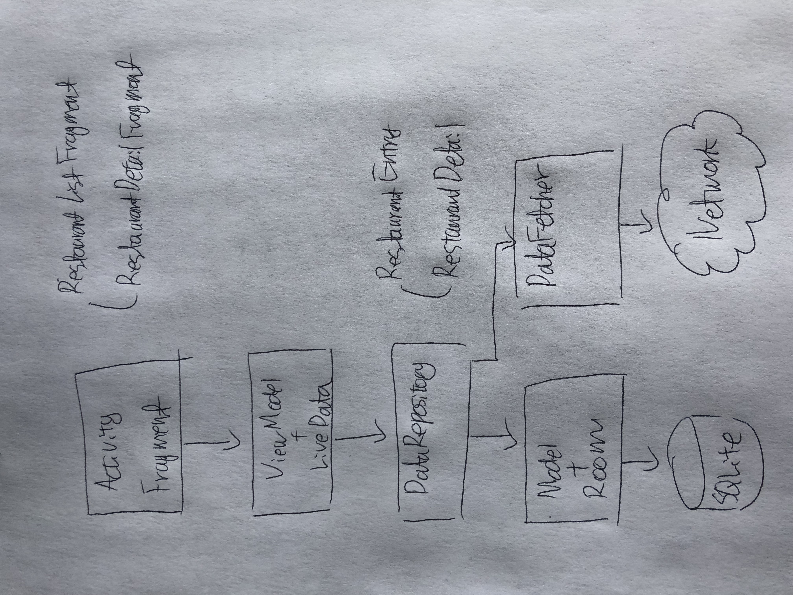

# DoorDash Lite

## Objective

### Minimum requirements
1. Create lite version of DoorDash app that shows list of stores, and basic store details
2. Support API level 14+

### North star
1. Create a DoorDash Lite with better user experience then current DoorDash app
2. Utilize best in practice to cover scalability and future flexibility
3. Write good tests from testable code base

### Stretch goals
1. Ability to support dynamic coordinate
2. Ability to sort stores (based on other category)
3. Ability to show store detail in separate UI

## Architecture
For this assignment, I would choose MVVM + data repository pattern given overall flow that UI depends on the data.

### Model
Data in this task is designed to be tiny POJO of `RestaurantEntry` and `RestaurantDetail` Once data is fetched it will be persisted to local SQLite DB using [Room](https://developer.android.com/topic/libraries/architecture/room.html). If new fetch happens and only if there are delta it will update local DB.
- `RestaurantEntry`: Small POJO to be used for list of restaurants
- `RestaurantDetail`: POJO to be used for showing restaurant detail
 
### ViewModel
In favor of utilizing Android's lifecycle aware callback view mode, ViewModel is extending `AndroidViewModel`[Ref.](https://developer.android.com/reference/android/arch/lifecycle/AndroidViewModel.html). It observes DataRepository's data and once data is emitted, it will update its view (who is already subscribing to the change)

### View
Using Android's [data binding library](https://developer.android.com/topic/libraries/data-binding/index.html), View is instantiated from its layout's variable. 
- For initial `RecyclerView` (`RestaurantListFragment`) is bind from `restaurant_entry.xml`'s variable `restaurant_entry` and `callback`.
- For detailed restaurant view, `RestaurantFragment` is bind from `restaurant_detail_fragment.xml`'s variable `RestaurantDetailViewModel`.

## Plans
1. Implement API and data persistent layer: First, define model, then create API to fetch data and associated data repository for models
2. Implement skeleton UI/business logic for store list: create `RestaurantListFragment` that shows list of restaurant from given coordinate
3. Implement skeleton UI/business logic for store detail: create `RestaurantFragment` that shows detailed information about restaurant
4. Add additional features:

    4.1 Sort (by TBD category)
    
    4.2 Use different GPS coordinate

## Misc.
- TBD

## Dependencies
Following libraries were used while working on this task:
- Android Architecture Components
    - [LiveData](https://developer.android.com/topic/libraries/architecture/livedata.html)
    - [ViewModel](https://developer.android.com/topic/libraries/architecture/viewmodel.html)
    - [Room Persistence Library](https://developer.android.com/topic/libraries/architecture/room.html)
    - [Android Data Binding library](https://developer.android.com/topic/libraries/data-binding/index.html)
- Network and Image handling
    - [Retrofit](http://square.github.io/retrofit/) 
    - [Picasso](https://github.com/square/picasso/)
- Test
    - [ASTL](https://developer.android.com/topic/libraries/testing-support-library/index.html)
    - [Espresso](https://developer.android.com/training/testing/espresso/index.html)
    - [JUnit](https://developer.android.com/training/testing/unit-testing/local-unit-tests.html) and [Mockito](https://github.com/mockito/mockito)
